# Documentation Labos : Administration de SQL Server

## Introduction

Ce document présente la réalisation des travaux pratiques d'administration SQL Server pour l'instance **MKGTDEV**, couvrant l'installation, la configuration des bases de données système et utilisateur, la planification de sauvegarde, et la gestion des accès.

---

## Labo 1 : Scénario d'installation et de paramétrage d'une instance

### Objectif
Installer et paramétrer une nouvelle instance de SQL Server nommée `MKGTDEV` en respectant les spécifications de l'équipe de développement.

### Spécifications de l'instance
| Élément | Configuration |
| :--- | :--- |
| **Nom de l'instance** | `MKGTDEV` |
| **Fonctionnalités** | Moteur de base de données seulement |
| **Répertoire des fichiers de données** | `D:\MKGTDEV` |
| **Répertoire des fichiers de Log** | `L:\MKGTDEV` |
| **Comptes des services** | Système NT |
| **Démarrage** | SQL Server et Agent SQL Server en automatique |
| **Mode d'authentification** | Mixte |

### Démarche et Résultats
1.  **Préparation de la Machine Virtuelle (VM) :** Deux disques virtuels (`D:` et `L:`) ont été créés pour séparer les fichiers de données et de log.
    
    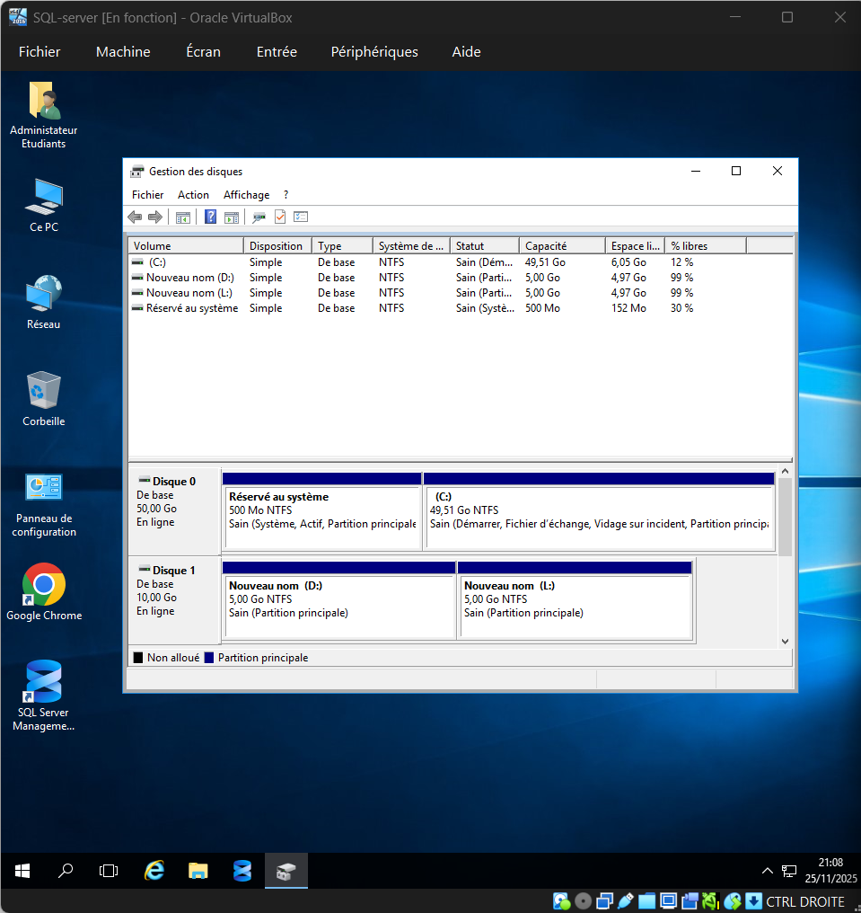
    
2.  **Lancement de l'installation :** Sélection de l'installation du Moteur de base de données.
    
    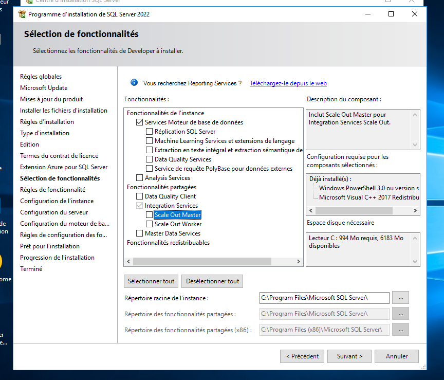
    
3.  **Configuration de l'Instance :** L'instance a été nommée `MKGTDEV`.
    
    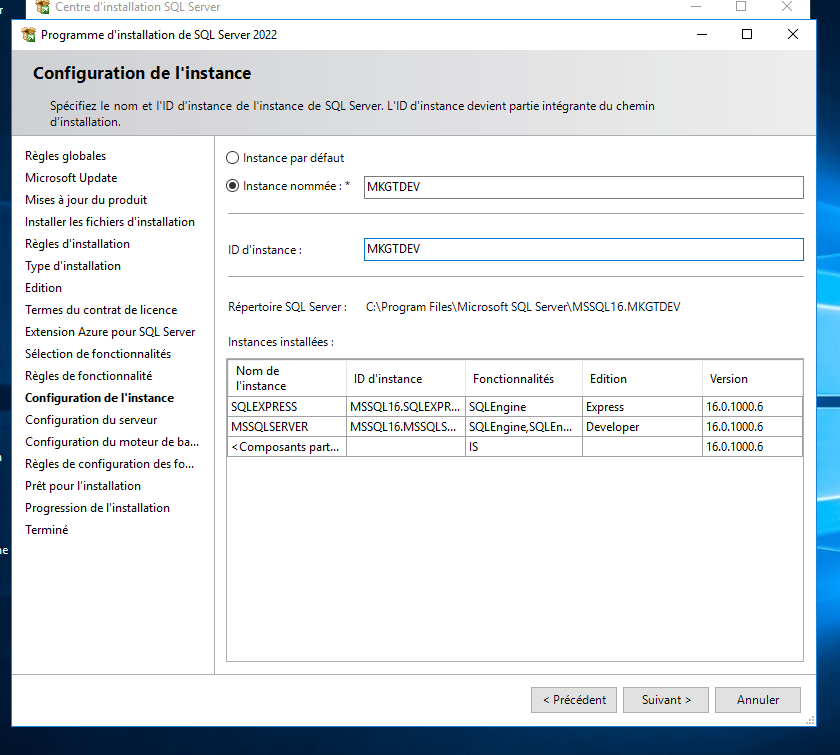
    
4.  **Configuration du Serveur :** Les services **SQL Server Agent** et **Moteur de base de données SQL** ont été configurés en démarrage **Automatique**.
    
    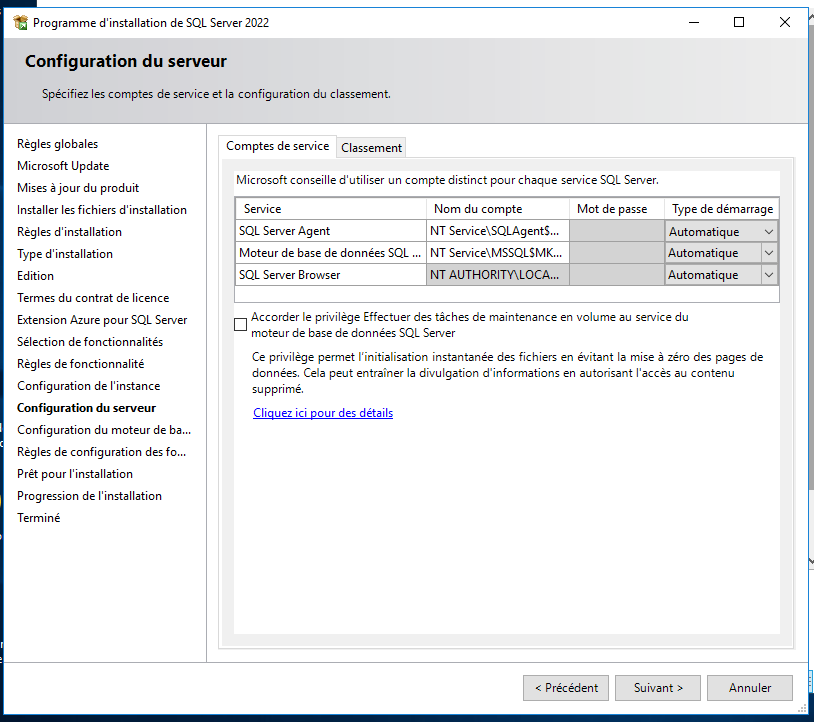
    
5.  **Répertoires de Données :** Les chemins des répertoires ont été configurés pour `D:\MKGTDEV` et `L:\MKGTDEV`.
    
    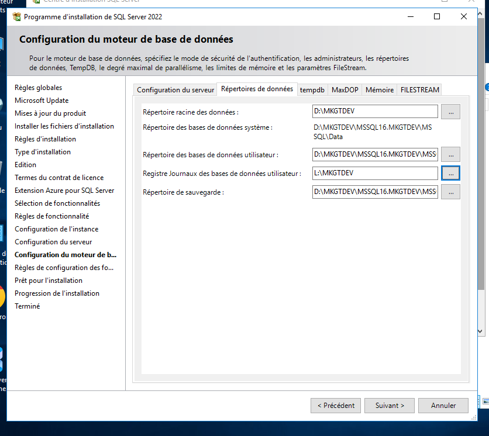
    
6.  **Installation :** Vérification finale du résumé avant l'exécution.
    
    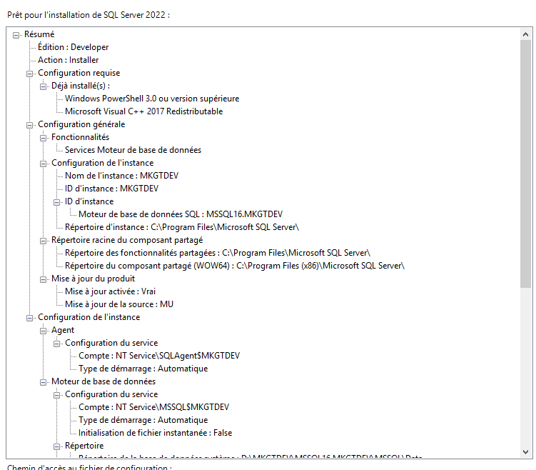
    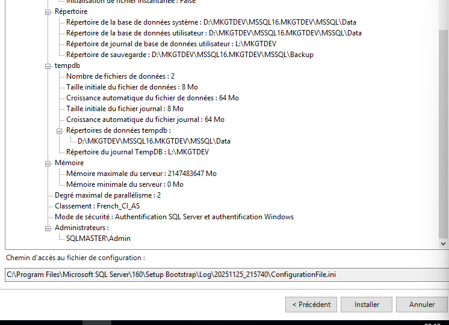

---

## Labo 2 : Création et paramétrage de la base de données 'Rate Tracking'

### Objectif
Créer la base de données `Rate Tracking` en respectant les spécifications de fichiers de données (taille, croissance) et la répartition sur les groupes de fichiers (`PRIMARY`, `USERDATA`, `ARCHIVE`).

### Spécifications
| Fichier/Élément | Groupe de fichier | Taille initiale | Répertoire |
| :--- | :--- | :--- | :--- |
| **Fichier de données principal** | `PRIMARY` | 10MB | `D:\MKGTDEV` |
| **Fichier de log** | Non appliqué | 20MB | `L:\MKGTDEV` |
| **Fichier de données secondaire #1** | `USERDATA` | 20MB | `D:\MKGTDEV` |
| **Fichier de données secondaire #2** | `USERDATA` | 20MB | `D:\MKGTDEV` |
| **Fichier de données secondaire #3** | `ARCHIVE` | 200MB | `D:\MKGTDEV` |

### Démarche et Résultats
1.  **Création des Groupes de Fichiers :** Les groupes de fichiers `USERDATA` et `ARCHIVE` ont été créés en amont de l'ajout des fichiers secondaires.
2.  **Création des Fichiers :** La base de données a été créée et les fichiers de données secondaires ont été ajoutés, mappés aux groupes de fichiers respectifs.


    * 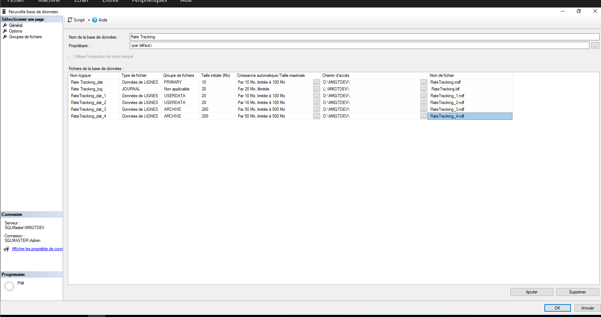
    * 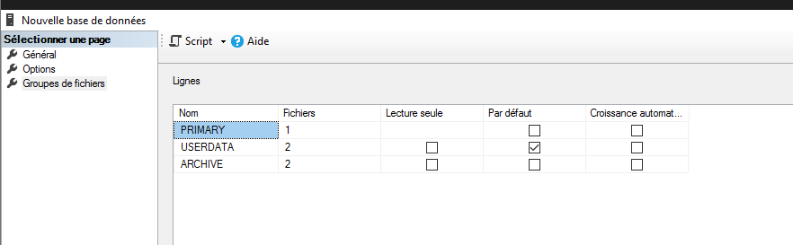

---

## Labo 2' : Reconfiguration de la base de données `tempdb`

### Objectif
Optimiser la base de données système `tempdb` en déplaçant ses fichiers sur les disques dédiés et en ajoutant de nouveaux fichiers de données pour un meilleur parallélisme.

### Modifications Apportées
* **Déplacement :** Fichiers de données vers `D:\MKGTDEV`, Fichier de log vers `L:\MKGTDEV`.
* **Nouveaux fichiers de données (tempdev2, tempdev3) :** Taille initiale 20MB, croissance 10MB, emplacement `D:\MKGTDEV`.

### Démarche et Résultats
1.  **Modification du chemin d'accès :** Les chemins des fichiers `tempdb` ont été modifiés via la commande `ALTER DATABASE` :
    ```sql
    ALTER DATABASE tempdb MODIFY FILE (NAME = tempdev, FILENAME = 'D:\MKGTDEV\tempdb.mdf');
    ALTER DATABASE tempdb MODIFY FILE (NAME = templog, FILENAME = 'L:\MKGTDEV\templog.ldf');
    ```
    
    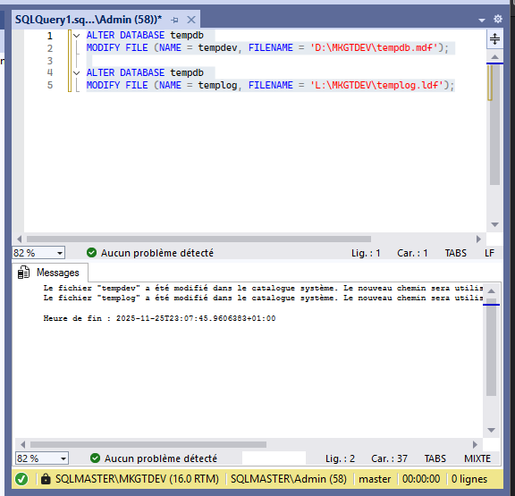
    
2.  **Ajout des fichiers secondaires :** Les fichiers `tempdev2` et `tempdev3` ont été ajoutés pour répondre aux besoins de l'application.
    
    
    
3.  **Validation :** Après redémarrage du service, les modifications sont effectives.
    

---

## Labo 3 : Sauvegarde et restauration

### Objectif
Intégrer la base de données `Adventure Works` et configurer un plan de sauvegarde automatique sur le disque `U:\BKPMKGTDEV` en utilisant l'outil **Plan de maintenance** et les **Travaux de l'Agent SQL Server**.

### Plan de Sauvegarde
| Jour | Type de Sauvegarde | Horaire |
| :--- | :--- | :--- |
| **Dimanche** | Complète | 3 h |
| **Lundi** | Incrémentielle | 5 h |
| **Mercredi** | Incrémentielle | 5 h |
| **Vendredi** | Incrémentielle | 19 h |

### Démarche et Résultats

1.  **Intégration de la base de données :** La base `Adventure Works` a été attachée à l'instance `MKGTDEV`.
    
    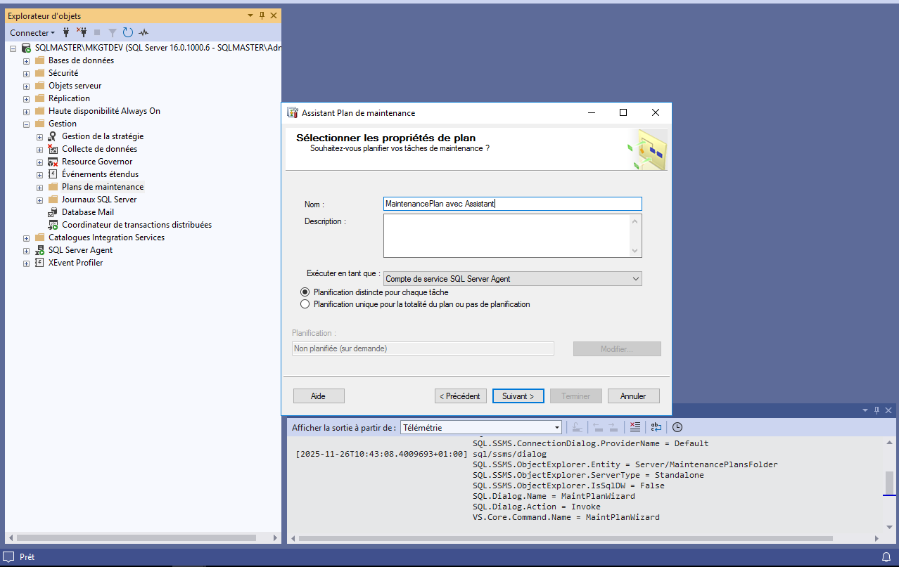

2.  **Planification avec Plan de Maintenance (Dimanche, Lundi, Mercredi) :** Un plan de maintenance a été créé pour gérer les sauvegardes Complètes et Incrémentielles de ces trois jours.
    
    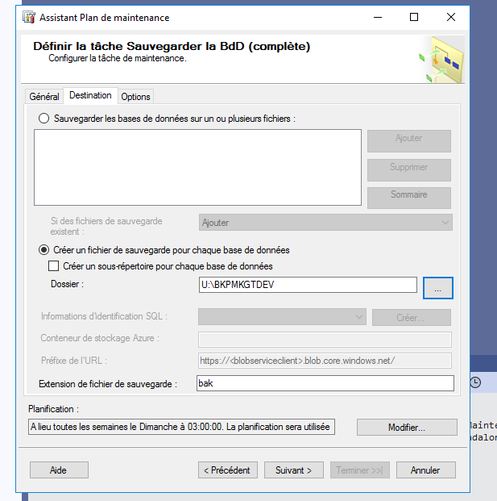
    [lundi/mercredi](./images/labo3_maintenance_plan_2.png)
    [plan recap](./images/labo3_maintenance_plan_4.png)
    
3.  **Planification avec Travail de l'Agent SQL Server (Vendredi) :** Un Travail (Job) séparé a été créé pour la sauvegarde Incrémentielle du Vendredi.
    
    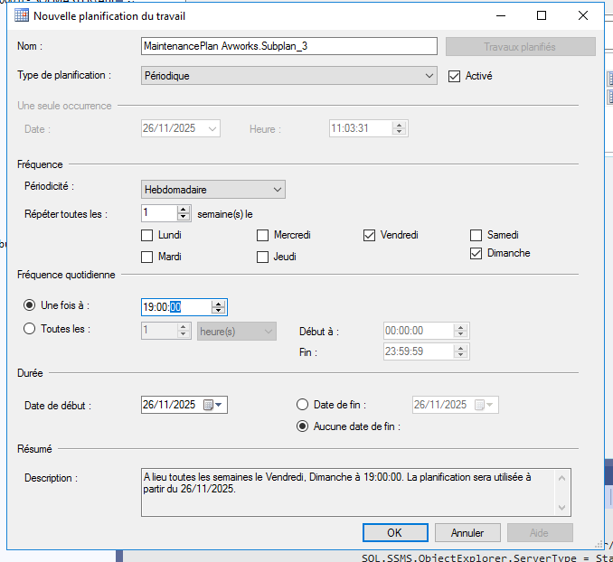
    
    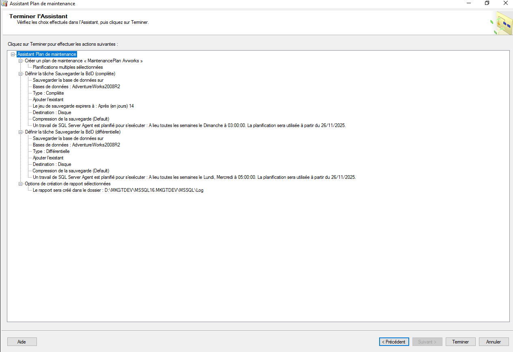
    
4.  **Résultat de l'exécution :** Les fichiers de sauvegarde sont générés sur le lecteur dédié `U:\BKPMKGTDEV`.
    
    

5.  **Agent d'assistance :** Permet une méthode alternative pour planifier les sauvegardes.
[visualisation d'un subplan](./images/labo3_subplan.png)

6.  **Planification des sauvegardes complètes :**
[création du dimanche](./images/labo3_planif_dimanche.png)

7.  **Planification des sauvegardes incrémentielles :**
[création du lun/mer et du ven](./images/labo3_planif_incrementielle.png)

8.  **SQL Associé :**
[Attention compatibilité SQL Server 2008 R2](./images/labo3_planif_SQL.png)

9.  **Vérification :**
[Test de vérifications](./images/labo3_verif.png)

---

## Labo 4 : Connexions et droits d'accès

### Objectif
Définir les Logins et les Utilisateurs pour la base `Adventure Works` selon les spécifications des développeurs.

### Démarche et Résultats
1.  **Création des Logins (Au niveau du Serveur) :** Les connexions ont été créées.
 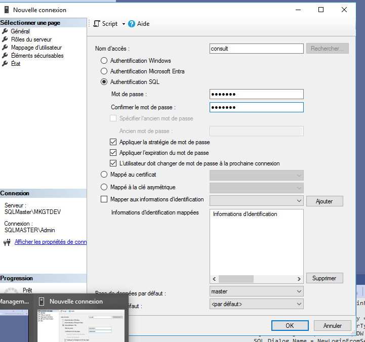
2.  **Création des Utilisateurs (Au niveau de la Base) :** Les utilisateurs ont été mappés aux bases de données et aux rôles appropriés.
    [Capture d'écran des Logins créés dans Win](./images/labo4_logins_win.png)
    [Utilisation du user Consult](./images/labo4_logins_consult.png)
    [Utilisation du user redact](./images/labo4_logins_redact.png)
    [Utilisation du user user1](./images/labo4_logins_user1.png)
    [Utilisation du user user2](./images/labo4_logins_user2.png)
    [Capture d'écran des Utilisateurs de la base de données Adventure Works (montrant le mappage aux logins)](./images/labo4_users_db.png)
